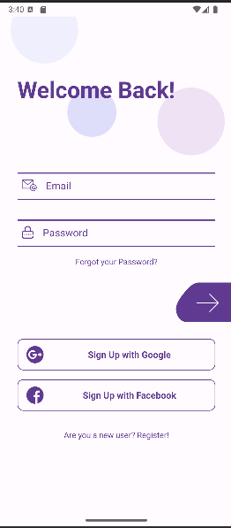
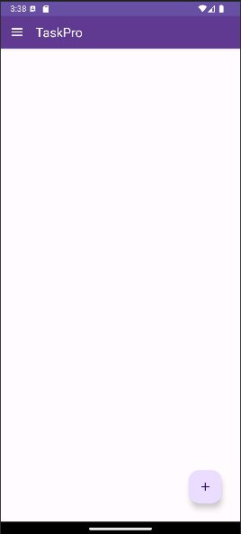
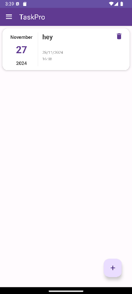
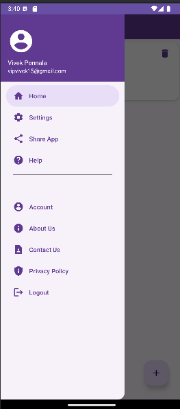
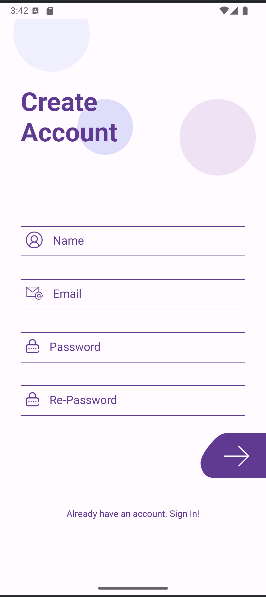

# CMPE_277_Final_Project

## Description
This repository contains the final project for **CMPE 277: Android Mobile Development**. The project is a mobile application designed to help users manage their tasks through a **to-do list** with built-in **daily reminders**. Additionally, the app integrates Google Maps for location-based task management, enabling users to associate tasks with specific locations for better organization.

The app leverages Android’s modern development practices to provide a seamless user experience, including features like notifications for reminders, persistent task storage, and Google Maps integration for geolocation functionality.

---

## Features
- **Task Management**: Create, edit, and delete tasks on the go.
- **Daily Reminders**: Get notified about your tasks every day at the scheduled time.
- **Google Maps Integration**: Link tasks to specific locations using Google Maps.
- **User-Friendly Interface**: Intuitive and responsive UI optimized for Android devices.
- **Offline Support**: Manage tasks even without an internet connection; data syncs when connectivity is restored.

---

## Project Structure
├── app/ │ ├── src/main/ │ ├── AndroidManifest.xml # Contains app configuration │ ├── java/com/cmpe277/todolist # Application logic and code │ ├── res/ # Resources (layouts, drawables, values) │ ├── assets/ # Google Maps API integration assets ├── README.md # Documentation

---

## Prerequisites
Before running the project, ensure you have the following:
- **Android Studio** (latest version recommended)
- **Google Maps API Key**
- A physical Android device or an emulator for testing.

---

## Setup Instructions
Follow these steps to set up and run the project:

**Clone the Repository**  
   Clone the repository to your local machine:
   ```bash
   git clone https://github.com/username/CMPE_277_Final_Project.git
   cd CMPE_277_Final_Project
   ```
---
**Open the Project in Android Studio**

Launch Android Studio.
Open the project by navigating to the folder containing the cloned repository.
Add Google Maps API Key

**Navigate to app/src/main/AndroidManifest.xml.**
Locate the placeholder for the Google Maps API key and replace YOUR_GOOGLE_MAPS_API_KEY with your valid API key:
xml
<meta-data
    android:name="com.google.android.geo.API_KEY"
    android:value="YOUR_GOOGLE_MAPS_API_KEY" />

---
**Build and Run the Application**

Connect your Android device or start an emulator in Android Studio.
Click on Run or press Shift + F10 to build and deploy the app.

---
**How to Use**
Create Tasks: Launch the app and add tasks using the intuitive UI. Provide a title, description, and optional location.
Set Reminders: Schedule daily reminders for tasks at your preferred time.
Track Tasks: Use the to-do list to track your pending and completed tasks.
Google Maps Integration: Associate tasks with specific locations for better organization. Use the integrated map to view tasks by location.

---
**Troubleshooting**
Error: Missing API Key
Ensure that you have replaced the placeholder YOUR_GOOGLE_MAPS_API_KEY in AndroidManifest.xml with a valid Google Maps API key.

---
**Emulator Issues**
If the Android Emulator doesn’t start, ensure that:

Hardware acceleration is enabled (HAXM or Hypervisor installed).
The emulator configuration matches the required minimum API level.
Permissions
If location services don’t work, ensure that the app has the necessary permissions:

Go to the device’s Settings > Apps > Your App > Permissions and enable location permissions.

---
## Working Mobile Project Features and Screenshots

Here are some key screenshots of the application:

### 1. Main Login Page


*Figure 1: The login page where users can enter their credentials.*

---

### 2. Main Page After Logging In


*Figure 2: The main page displayed after a successful login.*

---

### 3. Adding a Task


*Figure 3: A demonstration of how tasks are added and displayed.*

---

### 4. Options Page


*Figure 4: The options page for configuring settings.*

---

### 5. Registration Page


*Figure 5: The user registration page.*

